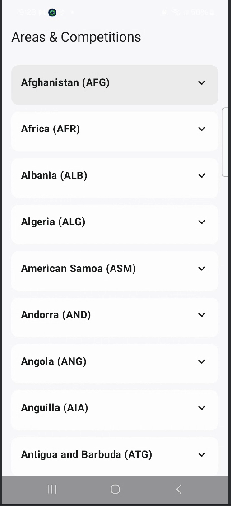
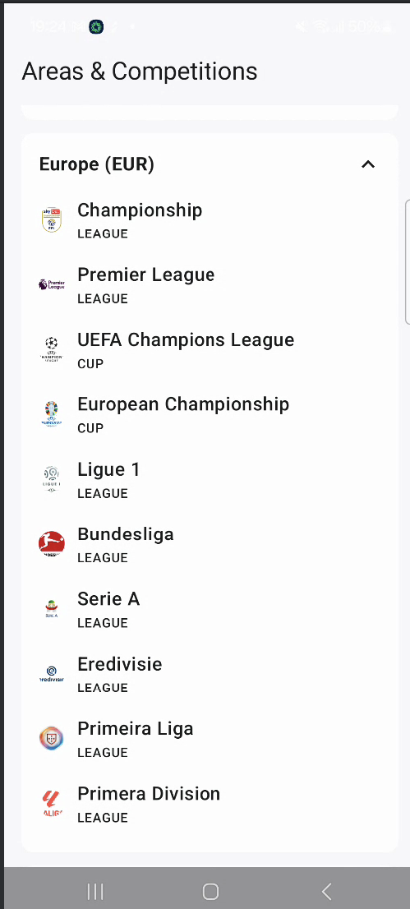
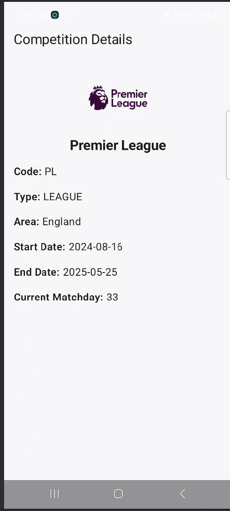

# ⚽ Football League Task

This is a simple Android application that displays a list of football **areas**, and for each area, a list of **competitions**. When selecting a competition, the app navigates to a **detailed view** of that competition.

The app supports **offline mode** by caching areas in a **Room database** and loading them when there is **no internet connection**.

---

## 📱 Features

- ✅ List football areas
- ✅ Expand to view competitions per area
- ✅ Navigate to competition details
- ✅ Offline support using Room for caching areas
- ✅ Internet connectivity check and snackbar notification
- ✅ Modern Android UI with Jetpack Compose
- ✅ Clean Architecture with MVI pattern
- ✅ Modularized structure

---

## 🧱 Architecture

The app is built following **Clean Architecture** principles:
presentation │ ├── Home (ViewModel, State, Action, Event) │
data ├── Repositories & Data Sources │
domain ├── UseCases & Business Models

---

## 🧩 Tech Stack

| Layer        | Libraries & Tools                          |
|--------------|--------------------------------------------|
| UI           | Jetpack Compose, Material3, Coil           |
| State Mgmt   | MVI Architecture                           |
| DI           | Hilt                                       |
| DB           | Room Database                              |
| Networking   | Retrofit                                   |
| Async        | Kotlin Coroutines, Flow                    |
| Modularity   | `core-ui`, `core-network`, `core-utils`    |
| Testing      | Compose UI Test, Hilt, JUnit, Turbine      |

---

## 🗂️ Modules

- **app** - Main application module
- **core-ui** - Shared UI components
- **core-network** - Retrofit setup, API services
- **core-utils** - Utility classes like NetworkChecker
- **data** - Data source, repository, DTOs
- **domain** - Business models and use cases

---

## 🧪 Testing

- ✅ Unit testing with JUnit, Mockito, and Turbine
- ✅ Integration testing using Compose UI Test + Hilt
- ✅ Custom fake data sources for reliable testing

---
## 📱 Screenshots

| Home Screen                        | Expanded View                      |
|-----------------------------------|------------------------------------|
|      |  |

### 🏆 Competition Details

